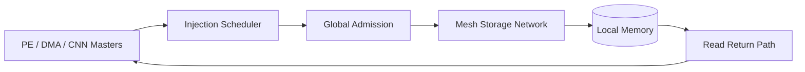

# STOR Mesh 存储互连设计与验证（脱敏展示版）

这是一个面向秋招技术交流的脱敏作品仓库，用于展示多主机共享存储互连项目中的架构设计、SystemC 建模、RTL 实现和 UVM 验证能力。

> 本仓库不是原工程的完整镜像。受知识产权和第三方工具许可限制，商用 VIP、工艺库、网表、完整业务模型、原始日志及个人材料均未包含；演示 RTL 是围绕项目关键机制重新编写的自包含版本。

## 项目目标

项目面向 AI 计算负载中的多主机共享存储访问，构建可扩展的 Mesh 存储互连。核心事务链路为：



主要关注以下问题：

- 多 master 对同一 target 的互斥准入与公平仲裁；
- burst 请求在 Mesh 中的路由一致性和资源生命周期；
- 读返回数据与发起端、事务 ID 的正确匹配；
- hotspot、长 burst 和反压场景下的可进展性；
- SystemC、RTL 与 UVM 测试点之间的可追溯对齐。

## 本人工作

- 使用 C++/SystemC 建立事务级参考模型，描述准入、调度、路由、存储访问和返回路径；
- 设计参数化 RTL 结构，并处理多 owner 仲裁、read slot、route cache 和错误状态观测；
- 搭建 SystemVerilog/UVM 验证环境，包含 driver、monitor、scoreboard、coverage 和 SVA；
- 建立 directed test、stress test、watchdog、回归与覆盖率分析流程；
- 根据仿真账本定位性能瓶颈，完成流水化、FIFO 深度和低功耗状态机优化。

## 阶段性结果

| 指标 | 脱敏结果 |
| --- | ---: |
| SystemC 测试点 | 79 项 |
| 已实现测试点 | 58 项 |
| P0 核心测试点 | 42 / 43 |
| UVM 功能覆盖率（阶段性历史回归） | 73.96% |
| UVM covergroup instance score（阶段性历史回归） | 85.11% |
| 最慢 PEA 完成周期优化 | 53585 → 47411（约 11.5%） |
| 8×6 网络 Golden 状态寄存器优化 | 1536 bit → 432 bit |

覆盖率数值来自一次阶段性 VCS/URG 合并回归，不代表后续所有提交的实时覆盖率。详细口径见 [验证方法](docs/VERIFICATION.md) 和 [结果与边界](docs/RESULTS.md)。

## 可运行演示

`rtl_demo/golden_owner_arbiter.sv` 是从项目活锁保护思路中抽取并独立重构的演示模块：

- 使用有界窗口计数器轮换 Golden Owner；
- 当前 Golden Owner 有请求时优先授权；
- Golden Owner 无请求时回退到固定优先级；
- 输出保持 one-hot grant。

Windows PowerShell：

```powershell
powershell -NoProfile -ExecutionPolicy Bypass -File ./scripts/run_demo.ps1
```

Linux/macOS（已安装 Icarus Verilog）：

```bash
mkdir -p build
iverilog -g2012 -s tb_golden_owner_arbiter \
  -o build/tb_golden_owner_arbiter.vvp \
  rtl_demo/golden_owner_arbiter.sv tb/tb_golden_owner_arbiter.sv
vvp build/tb_golden_owner_arbiter.vvp
```

期望输出：

```text
PASS tb_golden_owner_arbiter
```

## 文档导航

- [系统架构](docs/ARCHITECTURE.md)
- [验证方法](docs/VERIFICATION.md)
- [结果、限制与工程边界](docs/RESULTS.md)
- [公开范围说明](NOTICE.md)

## 技术栈

SystemC / C++、Verilog / SystemVerilog、UVM、SVA、Python、VCS / URG、Design Compiler、PrimeTime、Icarus Verilog。
