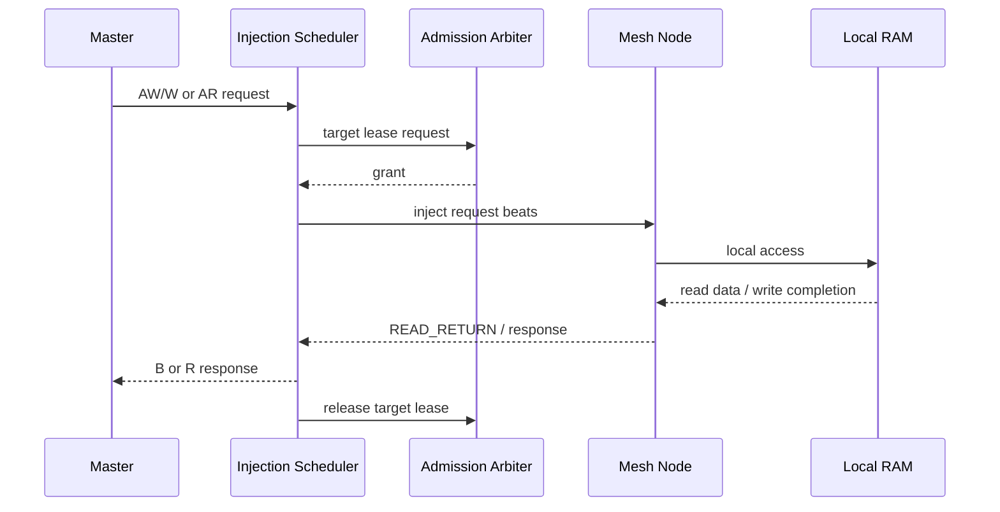

# 系统架构

## 1. 设计背景

多个计算单元并行访问分布式存储时，传统集中式总线容易在热点 target 上形成竞争。该项目将存储节点组织成二维 Mesh，通过入口调度、全局准入和分布式路由完成请求传输，并用独立返回路径处理读响应。

## 2. 事务路径

## 3. 关键机制

### Injection Scheduler

每个 master 配置独立入口调度器，负责 AXI-like 通道接收、准入申请、端口选择、事务槽位管理、返回数据重组和最终响应。

### Global Admission

对同一 target 建立 owner lease，防止多个入口同时创建相互冲突的路径。仲裁考虑请求类型、QoS、公平性和资源释放状态。

### Mesh 路由

首 beat 建立路径选择，后续 burst beat 跟随缓存结果，避免同一事务在中途改变方向。边界端口、local target 和返回流量分别进行冲突检查。

### READ_RETURN

读请求注入时记录返回信息；数据返回后根据事务槽位和 network ID 找到原 master，检查 beat 数、ID 和 last 语义，再释放相应资源。

### Golden Owner

当多个普通请求竞争有限 lane 时，按时间窗口轮换 Golden Owner，为低固定优先级 owner 提供周期性优先机会。展示仓库中的 RTL demo 仅实现这一机制的最小、独立版本。

## 4. 工程取舍

并发度并非越高越好。压力仿真显示，在当前资源依赖关系下，提高在途事务数会放大通道、target lease 和返回路径之间的循环等待风险。因此最终配置以已验证的安全并发度为基线，再通过本地 FIFO、读 buffer 和 phase 去屏障提高流水效率。
